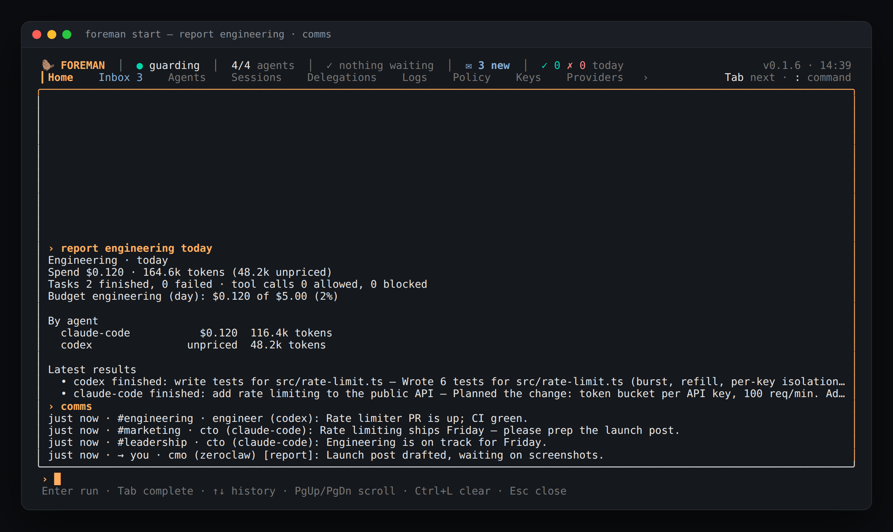

# Foreman Org — run your company as a crew of agents

Real companies scale through structure: a CEO sets direction, department
heads own their areas, teams execute, and work moves along reporting lines.
Foreman Org gives your agents the same shape — and enforces it.

```
Acme Inc.
you (Founder)
└─ ceo · Chief Executive (agent) · ● hermes
   ├─ cto · CTO · ● claude-code [Engineering] mcp: github, filesystem, playwright, sentry
   │  └─ engineer · Software Engineer · ● codex [Engineering]
   ├─ cmo · CMO · ● openclaw [Marketing] mcp: notion, brave-search, youtube
   ├─ cfo · CFO · ● zeroclaw [Finance] mcp: stripe
   └─ support-lead · Support Lead · ○ generic-mcp [Customer Support] mcp: notion
```

## Quick start

```bash
foreman org templates                                  # startup · software-team · solo
foreman org init --template startup --company "Acme"   # writes org.yaml
foreman org show                                       # the chart above
foreman org sync                                       # push roles to registered agents
foreman org assign marketing "draft the launch post"   # department → its head
```

Any registered runtime can fill a role — Claude Code, Codex, Hermes,
OpenClaw, ZeroClaw or your own MCP agent (`foreman agent add <id>`, where
`<id>` is a catalog id from `foreman registry list`).

## What the chart enforces

**Delegation follows reporting lines.** When an agent hands work to another
(`/foreman write <agent> …` from chat, or `foreman write` from a shell
Foreman spawned for it), Foreman checks the chart:

| From → To                                    | Default                            |
| -------------------------------------------- | ---------------------------------- |
| manager → direct report                      | ✅                                 |
| manager → anyone below (`skip_levels: true`) | ✅                                 |
| report → own manager                         | ✅                                 |
| colleagues in the same department            | ✅                                 |
| department head ↔ department head            | ✅ (`cross_department: via_heads`) |
| anyone else across departments               | ❌ "hand it to your manager"       |
| you (terminal / owner) → anyone              | ✅ always                          |

`cross_department` can also be `allow` or `deny` (isolated departments).
`foreman org check <from> <to>` explains any decision. Each side can be an
agent id or a role id; a name that is neither is reported by side and the
command exits 1. A blocked hand-off shows the chart's reason and the route it
allows instead (`next: hand it to cto (claude-code), engineer's manager, …`).

`policy.yaml` is checked first (see
[hand-offs](policy.md#hand-offs-between-agents)): a `cannot_call` rule for
the pair, or a `can_call` list for the target that leaves out `write`, blocks
the hand-off even when the chart allows it, and an `ask` rule sends it to you.
A `can_call` allow doesn't lift a block from the chart. `foreman org check`
says when `policy.yaml` decides, and when no rule applies and the chart does.

**Roles limit what their agent may do.** A role's `can` lists what its
agent may do with its own tools: `read` files, `write` files, run `shell`
commands, reach the `network`. A code reviewer with `can: [read]` that tries
to edit a file is refused (`org:role` in the audit log), whatever
`policy.yaml` says, and the agent is told why. See
[roles and permissions](#roles-ready-made-your-own-and-what-each-may-do).

**Least-privilege tools.** Each department (or a single role) lists the
[MCP hub](./mcp-hub.md) servers it may use. Finance sees Stripe, not GitHub;
engineers see GitHub, not Stripe. Fewer tools per agent also means fewer
tokens per turn.

**You stay on top.** Approvals for risky calls always come to you (TUI,
Telegram), whatever the chart says. A manager agent can add a
recommendation ([approval escalation](#approval-escalation)), but only you
decide.

## `org.yaml`

```yaml
version: 1
company: "Acme Inc."
mission: "Ship a great product with a small team."
human: { title: Founder }
delegation:
  cross_department: via_heads # via_heads | allow | deny
  skip_levels: true
approvals:
  escalate_via_manager: true # optional; managers recommend, you decide
departments:
  engineering:
    name: Engineering
    head: cto
    mcp_servers: [github, filesystem, playwright, sentry]
roles:
  ceo:
    title: Chief Executive (agent)
    agent: hermes
    reports_to: human
    responsibility: "strategy, planning, delegation"
  cto:
    title: CTO
    agent: claude-code
    department: engineering
    reports_to: ceo
  engineer:
    title: Software Engineer
    agent: codex
    department: engineering
    reports_to: cto
    model: <cheaper-model-id> # optional: a cheaper model for routine work
  reviewer:
    title: Code Reviewer
    agent: reviewer
    department: engineering
    reports_to: cto
    instructions: "Review changes and report findings with file and line. Don't edit files."
    can: [read] # optional: read | write | shell | network
```

Validation (`foreman org validate`) rejects reporting cycles, unknown
managers or departments, and heads outside their own department, and warns
about roles filled by agents you haven't registered yet.

## Commands

| Command                                                                                                                                               |                                                                                        |
| ----------------------------------------------------------------------------------------------------------------------------------------------------- | -------------------------------------------------------------------------------------- |
| `foreman org templates`                                                                                                                               | Starter charts                                                                         |
| `foreman org init [--template t] [--company n] [--force]`                                                                                             | Create org.yaml                                                                        |
| `foreman org show [--json]`                                                                                                                           | The chart, with registration status and tool access                                    |
| `foreman org validate`                                                                                                                                | Structure + warnings                                                                   |
| `foreman org check <from> <to>`                                                                                                                       | Explain a delegation decision (agent or role ids; `policy.yaml` first, then the chart) |
| `foreman org assign <role\|department\|agent> <task…>`                                                                                                | Queue a task (needs `foreman start` running)                                           |
| `foreman org sync`                                                                                                                                    | Push titles / responsibilities / model overrides into the agent registry               |
| `foreman org upgrade`                                                                                                                                 | Upgrade every agent runtime the org uses                                               |
| `foreman org add-department <id> --head <role> [--agent a] [--name n]`                                                                                | Add a department and its head                                                          |
| `foreman org roles`                                                                                                                                   | Ready-made roles for `add-role --preset`                                               |
| `foreman org add-role <id> (--agent a \| --runs-on claude-code\|codex) [--preset p] [--describe text] [--can list] [--department d] [--reports-to r]` | Add a role (defaults to reporting to the department head)                              |
| `foreman org report [target] [period]`                                                                                                                | What a department, role or agent did, and what it cost                                 |
| `foreman org budget <department> [usd\|off] [--daily] [--pause]`                                                                                      | Set or remove a spend limit                                                            |
| `foreman org escalate [on\|off]`                                                                                                                      | Send low/medium-risk approvals to the requester's manager agent for a recommendation   |
| `foreman usage [period] [--by department\|agent\|model]`                                                                                              | Spend at a glance                                                                      |
| `foreman usage env <agent>`                                                                                                                           | Turn on spend tracking for an agent you start yourself                                 |
| `foreman org messages [channel] [--follow]`                                                                                                           | Read your agents' conversations                                                        |
| `foreman org tell <target> <message…>`                                                                                                                | Post to a department, role, leadership or all-hands                                    |
| `foreman org channel <target> <platform> <channel\|off>`                                                                                              | Mirror a channel to Slack / Discord                                                    |

## Grow the company

Any number of departments, any names. Each one is a line:

```bash
foreman org add-department sales --head cso --agent codex --name Sales
foreman org add-role sdr --agent hermes --department sales --title "Sales rep"
foreman org add-role analyst --agent claude-code --department sales --model claude-haiku-4-5
foreman org show
```

A new role reports to its department head unless you say otherwise
(`--reports-to`). Both commands check the whole chart before saving, and
they keep the comments in `org.yaml`. You can still edit the file by hand;
it's read again on every delegation, so no restart is needed.

### Roles: ready-made, your own, and what each may do

A role is a job, not a program: any agent can fill any role. Foreman ships
ready-made roles to start from (`foreman org roles`): manager, developer,
code-reviewer, researcher, writer, analyst, support and assistant. Each has a
title, instructions for the agent and a sensible `can`:

```bash
foreman org roles
foreman org add-role reviewer --preset code-reviewer --runs-on claude-code --department engineering
foreman org add-role research --preset researcher --runs-on claude-code
```

Or describe your own, in your own words:

```bash
foreman org add-role chores --runs-on claude-code --title "Chores" \
  --describe "Tidy the issue tracker: label new issues, close duplicates, ping stale ones." \
  --can read,network
```

- `--runs-on claude-code|codex` fills the role with a new instance named after
  the role ([several roles on one agent](#several-roles-on-one-agent)).
  `--agent <id>` gives it to an agent you already registered instead.
- `--describe` (org.yaml `instructions`) is what the agent is told when
  Foreman hands it work, after who it is and before the task.
- `--can` (org.yaml `can`) limits the agent's own tools to `read`, `write`,
  `shell` and `network`, in any mix. `--preset` and `--describe` can be
  combined, and any flag overrides the preset.

How `can` works:

- It only narrows. A role without `can` is limited by `policy.yaml` alone,
  and `can` never allows what `policy.yaml` denies or asks about.
- An agent in several roles may do what any of them may; a role of its
  without `can` lifts the limit.
- It covers file reads and writes, shell commands and web access. Foreman's
  own tools (channels, reports, hand-offs) follow the chart, and hub servers
  follow `mcp_servers`.
- It is checked for Claude Code's tools by its hook, and for everything that
  goes through Foreman's MCP server. The hook knows an instance by the
  launch Foreman gave it (see [Limits](#limits)).
- A broken `org.yaml` that sets `can` fails closed: reads, writes, shell and
  web calls are refused until `foreman org validate` passes.

### Several roles on one agent

You don't need a different agent for each role. Register Claude Code or Codex
again under a name per role, and give each name a role:

```bash
foreman agent add codex                          # the agent itself
foreman agent add backend  --type codex          # a second Codex
foreman agent add frontend --type codex          # a third
foreman agent add reviewer --type claude-code    # a second Claude Code
foreman org add-role backend-dev  --agent backend  --department engineering --responsibility "the login API"
foreman org add-role frontend-dev --agent frontend --department engineering
foreman org add-role code-reviewer --agent reviewer --department engineering
```

Each instance is its own agent. It has its own identity token, its own role,
department channels and hub servers, and its own line in the audit log and
reports. When Foreman hands an instance work, it runs Codex or Claude Code as
that instance:

- with its own Foreman MCP server for that run (Codex `-c mcp_servers.foreman.*`,
  Claude Code `--mcp-config`, which takes precedence over the `foreman` entry
  in your settings), and its identity token in an owner-only file under
  Foreman's state directory, never on the command line. So what it posts
  and hands on is attributed to it, as trusted;
- told its role: the org.yaml title, department, responsibility and
  instructions (`--append-system-prompt` for Claude Code, before the task
  for Codex).

`foreman org add-role <id> --runs-on codex` does both steps in one: it adds
the instance, named after the role, and the role.

The agent's own config (`~/.codex/config.toml`, `~/.claude.json`) stays wired
to the agent itself: adding an instance, `agent rewire` and `doctor` leave it
alone. Instances work for Claude Code and Codex. For Hermes, OpenClaw and
ZeroClaw a second instance runs with the agent's own wiring (pass
`--config-path` to give it a config of its own).

## Department channels

Agents talk to each other the way a company does: in department rooms,
in leadership, at all-hands, and one-to-one. They report up to their
manager. Everything goes through Foreman, and you can read all of it.

| Channel         | Who can post                                                                          |
| --------------- | ------------------------------------------------------------------------------------- |
| `#<department>` | its members; other departments only through the heads (`delegation.cross_department`) |
| `#leadership`   | department heads and the roles that report to you                                     |
| `#all-hands`    | everyone in the org                                                                   |
| role ↔ role     | a role with its manager, its reports and its department (and heads with heads)        |
| → you           | anyone: reports and questions for you land in the TUI inbox                           |

Agents use three MCP tools (every agent on `foreman mcp-stdio` has them):

- `org_post(to, text, kind?)`: `to` is a department, a role, `leadership`,
  `all` or `boss`.
- `org_read(channel?, since?)`: what the agent may see.
- `org_report(text)`: a report to its manager, or to you from the top.

A fourth tool, `org_recommend`, answers review requests (see
[approval escalation](#approval-escalation)).

Refusals say why ("write to your department head, who can take it to
marketing"). Every post is audited (`org:message`), secrets are redacted,
and nothing in a message is ever executed. Only you post as yourself:
`boss`, `all`, `leadership` and the other channel words are reserved, so
no role, department or agent can use them.

**You** read and write from anywhere Foreman knows it's you:

```bash
foreman org messages                 # everything, newest last
foreman org messages marketing --follow
foreman org tell marketing "launch post goes out Friday"
foreman org tell all "welcome to launch week"
```

In the TUI console, or `/foreman` in two-way Slack or Discord: `comms`,
`comms marketing`, `tell marketing …`.

### Mirror them to Slack or Discord

```bash
foreman org channel marketing slack "#marketing"
foreman org channel engineering discord 123456789012345678
foreman org channel all slack "#company"
foreman org channel leadership slack "#leadership"
foreman org channel boss slack "#foreman-reports"     # what agents send you
foreman org channel direct slack "#agent-threads"     # role-to-role threads
```

`foreman start` posts each message there as it happens, with the author's
role and agent. That way you (and your team) can follow every department
in Slack or Discord. Mirroring uses the **bot** from `notify.yaml`
(`bot_token_ref`), so invite the bot to those channels. Agents never hold
the tokens, and mentions are neutralised: an agent can't ping @everyone.
`foreman doctor` warns if a mapped platform has no bot.

A new chat platform is a small adapter (`OrgMirror`) plus a key in
`org.yaml`; the channel maps take any platform name.

## Approval escalation

A real manager glances at what their team is about to do. Turn this on and
your manager agents do the same for low- and medium-risk approvals:

```bash
foreman org escalate on      # writes approvals.escalate_via_manager: true
foreman org escalate off
```

When an agent asks for an approval, and it reports to a manager **agent**
in the chart:

1. The approval comes to you as usual (TUI, Telegram, Slack, Discord).
2. Foreman also posts a review request on the manager's thread with that
   report (`cto ↔ engineer`, kind `review`). It has a review id (`rv_…`),
   the tool, the arguments, the risk score and the reasons. It never
   contains the approval id, so the review can't be used to answer the
   approval itself.
3. The manager answers once, with the `org_recommend` MCP tool:
   `org_recommend(review_id, recommendation: "allow" | "deny", reason)`.
4. You see the recommendation where you decide:
   - on the TUI approval screen, under "Manager review":
     `CTO (claude-code, unverified id) recommends allow: read-only, same repo`;
   - in the inbox;
   - as a follow-up on the chat where the approval is waiting.

It is advice. Your decision is still required and final. A recommendation
never approves or denies anything. It doesn't make the approval last
longer or shorter, and it doesn't change what happens on timeout (the
default is still deny).

Who can recommend:

- only the requester's manager, as the chart says now;
- not a colleague, another department, or the requesting agent itself;
- not a blocked or disabled agent, whatever the case of its id;
- not you. You decide instead.

**High and critical** approvals are never sent for review. They come
straight to you. Approvals from agents that report to you directly, or
whose manager is the same agent, aren't sent for review either. A burst is
coalesced: a report's manager gets at most one review request every 30
seconds, and the approvals in between come only to you.

### What is sent where

| What                                                | Where it goes                                                                                                                                                                                          |
| --------------------------------------------------- | ------------------------------------------------------------------------------------------------------------------------------------------------------------------------------------------------------ |
| Review request: tool name, risk, reasons, arguments | The manager agent (through `org_read`, so into its model's context) and `org_messages` in Foreman's local database. It is **not** mirrored to Slack or Discord, even when `channels.direct` is mapped. |
| The recommendation and its reason                   | Your TUI, inbox and approval chat; the thread (`foreman org messages`), which is mirrored to `channels.direct` if you mapped it; the audit log (`org:recommendation`).                                 |

Before the arguments go to the manager, Foreman masks the values of keys
that look sensitive (`pass`, `secret`, `token`, `key`, `auth`, `cookie`,
`credential`, `session`, at any depth, any case), inline credentials such
as `Authorization: Bearer …` or `--password=…`, and known secret shapes
(API keys, private keys). A secret under an innocent key, in a format
Foreman doesn't recognise, can still get through. Don't turn escalation on
for reports whose tool calls routinely carry secrets the manager shouldn't
see.

Tool names, agent ids and reasons are shown on one line each, with control,
bidi and zero-width characters removed and a length cap, so they can't pose
as a line of Foreman's own. Reasons are clipped to 300 characters (160 on
the approval screen).

Every recommendation attempt is audited as `org:recommendation`. Closed
reviews are pruned after 30 days. The review needs `foreman start` running,
since that is where approvals reach you.

## Spend and reports

Ask what a department did and what it cost, from any surface:



```bash
foreman org report marketing today        # or week, month, 7d, 24h
foreman org report                        # the whole company, by department
foreman usage month --by agent
```

In the TUI console, Telegram, Slack or Discord:

```
/foreman report marketing month
/foreman spend                  # today, by department
```

A report shows:

- spend, and tokens (input, output, cache);
- finished and failed tasks, and cost per finished task;
- tool calls allowed and blocked;
- the latest task results;
- budget use.

It needs no LLM. `report me` still asks Foreman's own LLM for a narrated
summary.

### Where the numbers come from

| Source              | How                                                                                                                                                                             | Precision                                                                                                                                |
| ------------------- | ------------------------------------------------------------------------------------------------------------------------------------------------------------------------------- | ---------------------------------------------------------------------------------------------------------------------------------------- |
| **Agent telemetry** | Claude Code (and Codex) export OpenTelemetry. `foreman start` listens on `127.0.0.1:4319` and keeps only per-request token counts, model and cost; prompts never reach Foreman. | Exact, cost included                                                                                                                     |
| **Task output**     | Usage an agent CLI prints when it finishes a task (`tokens used: N`, Claude JSON results), used only when that task sent no telemetry                                           | Tokens exact; cost estimated (≈) from list prices when the model is known (the role's or agent's `model`), otherwise shown as _unpriced_ |
| **Foreman itself**  | Its own LLM calls (`llm_usage`)                                                                                                                                                 | Exact                                                                                                                                    |

Tasks Foreman starts (`foreman write`, `assign`, delegation between
agents) report automatically: the agent gets the exporter settings with a
key of its own. Foreman books whatever arrives with that key to that
agent and task, so an agent can't bill another department. For agents
**you** start, run this once:

```bash
foreman usage env claude-code   # prints the export lines for your shell profile
foreman usage env codex         # prints the [otel] block for ~/.codex/config.toml
```

Spend is attributed to the agent's role and department at the time it
happens. Moving an agent later doesn't rewrite history. If port 4319 is
taken, set `FOREMAN_OTLP_PORT`. The inbox tells you when that happens.

### Budgets

```bash
foreman org budget marketing 50            # $50 a month, alert at 80% and 100%
foreman org budget marketing 5 --daily     # and $5 a day
foreman org budget marketing 50 --pause    # when spent, agents can't hand it new work
foreman org budget marketing off
```

The budget lands in `org.yaml`:

```yaml
departments:
  marketing:
    name: Marketing
    head: cmo
    budget: { monthly_usd: 50, daily_usd: 5, on_exceed: pause }
```

Alerts go to the TUI inbox and to the channels on your `budget_alert` route.
With `pause`, agents can't delegate into the department until the period
resets. You can still assign work to it yourself.

## Scaling and upgrades

- Add a department or role by editing `org.yaml` — no restart needed; the
  chart is read on every delegation.
- `foreman org upgrade` updates all runtimes in one go (npm-installed agents
  are upgraded through npm; script-installed ones get the exact re-install
  command).
- `model:` per role lets routine roles run on a cheaper model — the single
  biggest lever on cost.

## Limits

- On the MCP path an agent holds its role only when it proves its id with its
  identity token ([agent identity tokens](./agent-lifecycle.md#agent-identity-tokens)).
  A connection without it runs as `untrusted:<id>`: no role, no department
  channels, no hub servers, and it can't delegate. `foreman write` run from
  an agent's shell still trusts `FOREMAN_SPAWNED_BY` (see [SECURITY.md](../SECURITY.md)).
- A broken `org.yaml` fails closed: agent-to-agent delegation is blocked and
  agents get no hub servers until `foreman org validate` passes.
- Claude Code's hook tells an instance from Claude Code itself by
  `FOREMAN_SPAWNED_BY`, which Foreman sets when it launches the instance.
  It is only honoured when it names a registered instance of that same
  agent, but a process that can set its own environment can claim one:
  the same trust `foreman write` gives it. Claude Code run by you, with no
  such variable, is Claude Code itself.
- Codex has no hook before its own tools run: a Codex instance's built-in
  shell and file edits follow Codex's sandbox and approval settings. Its
  role's `can` applies to what goes through Foreman.
- A manager's recommendation is only as trustworthy as the manager agent.
  Agent ids are self-declared, so any process that starts
  `foreman mcp-stdio --source <manager-id>` can recommend as that manager.
  That is why recommendations are labelled "unverified id". Treat them as a
  second opinion, not proof. Per-agent identity tokens (#618) will close
  this gap.
- Messages you or your team type in a mirrored Slack / Discord channel are
  not read back (that needs privileged message-content access). Use
  `/foreman tell <department> …` there instead.
- Spend covers what agents report: tasks Foreman starts, and agents you set
  up with `foreman usage env`. An agent that exports nothing and prints no
  usage shows tasks and tool calls, but no spend.
