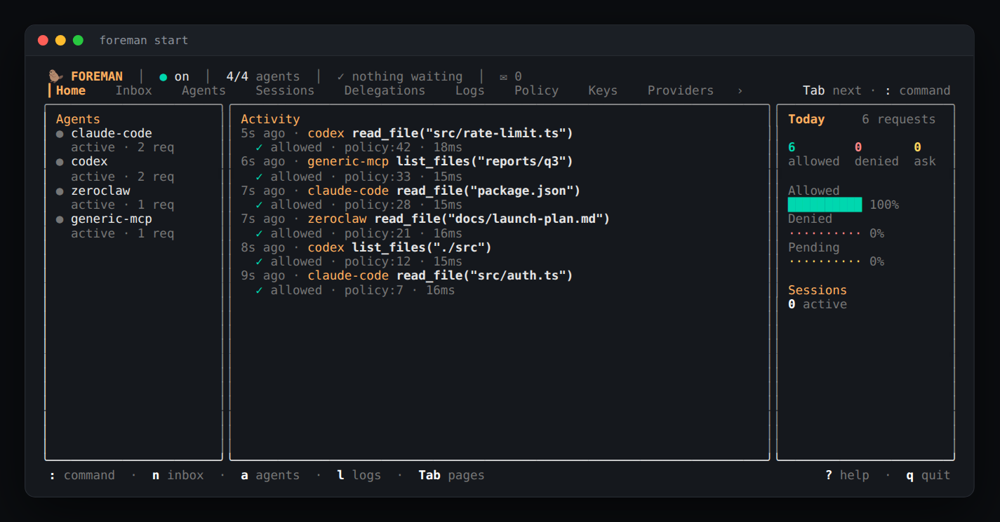
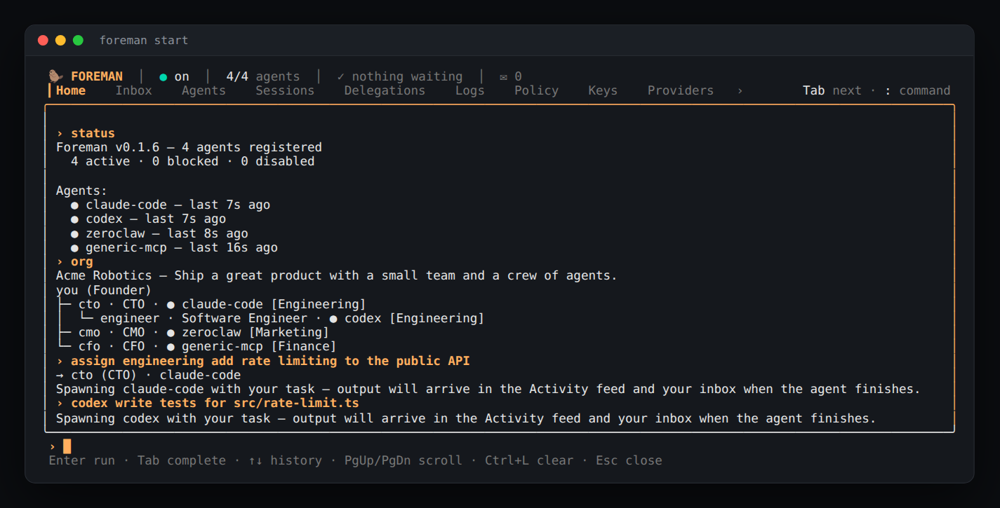
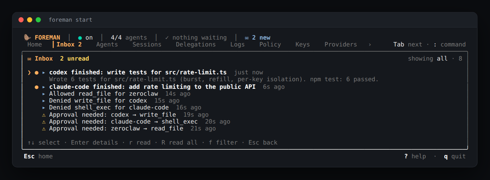

# The Foreman TUI

`foreman start` opens the terminal UI. It is where you watch your agents,
answer approvals, read what you missed and give commands. Telegram, Slack,
Discord, email and ntfy are optional extras: everything works from the
terminal alone.



## At a glance

The header answers "is anything waiting on me?" from every page:

```
🦫 FOREMAN │ ● guarding │ 4/4 agents │ ⚠ 2 waiting │ ✉ 3 new │ ✓ 120 ✗ 3 today
```

- **agents**: how many registered agents are online.
- **waiting**: approvals you haven't answered yet.
- **new**: unread items in your inbox.
- **today**: calls allowed and denied since midnight.

The tab row under it lists every page. `Tab` / `Shift+Tab` move between
them from any page, and `Esc` goes back to Home. On the Home page each
page also has a one-letter shortcut (`n` inbox, `a` agents, `l` logs, …;
see below), and `?` or `h` opens the full key list. The bottom line shows
the keys that work on the page you're on.

## Pages and keys

These work on every page, unless you are typing into a field:

| Key | |
| --- | --- |
| `:` | open the [command console](#command-console) |
| `Tab` / `Shift+Tab` | next / previous page |
| `n` | the [inbox](#inbox), except on Keys, Providers, Services and Integrations, where `n` means "new" |
| `Esc` | back to Home |
| `q` / `Ctrl-C` | quit: at once, or after a `y` / `n` question while approvals are waiting |

On the Home page:

| Key | Page | Key | Page |
| --- | --- | --- | --- |
| `n` | Inbox | `k` | Keys (the secret store) |
| `a` | Agents | `v` | Providers (LLM keys and sign-ins) |
| `s` | Sessions | `V` | Services (Telegram, GitHub, … tokens) |
| `d` | Delegations | `g` | Settings |
| `l` | Logs | `c` | Test (send a test call as an agent) |
| `p` | Policy | `i` | [Integrations](integrations.md) (GitHub, GitLab, Jira, Trello, Linear, Notion) |
|  |  | `?` / `h` | help |

`/` also opens the console on Home.

Keys on each page:

| Page | Keys |
| --- | --- |
| Agents | `↑↓` select, `Enter` details, `d` / `e` disable / enable, `b` block / unblock, `N` note, `L` LLM, `m` model (or back to the default), `o` login, `r` regenerate key, `x` remove. See [`agent-lifecycle.md`](agent-lifecycle.md#tui-flow). |
| Logs | `/` search (`Enter` keeps the filter, `Esc` clears it), `1`–`4` toggle allowed / denied / ask / errored, `↑↓` select, `Enter` details, `r` replay, `e` export |
| Policy | `↑↓` select, `Enter` details, `d` turn the rule on / off, `e` edit `policy.yaml` in `$EDITOR`. See [`policy.md`](policy.md#the-tui-policy-page). |
| Sessions | `↑↓` select, `Enter` details, `k` halt the session |
| Delegations | `↑↓` select, `Enter` details |
| Keys | `↑↓` select, `Enter` details, `n` new secret, `v` reveal, `r` rotate, `d` delete |
| Providers, Services | `↑↓` select, `Enter` details, `n` configure the selected one, `r` rotate, `d` remove (asks first), `s` show the value for 10 s; `o` sign in with a Claude / ChatGPT subscription (Providers), `w` setup walkthrough (Services) |
| Integrations | `↑↓` select, `Enter` details (credentials, sign-in, which agents may use it), `n` add (variant, access level, who, token or browser sign-in, then review and enable), `space` enable / disable, `e` edit (access level, who, replace a credential, sign in again), `t` tools (`←→` sets a per-tool rule), `r` review, `o` sign in, `d` remove (asks first; `Enter` cancels) |
| Settings | `↑↓` select, `Enter` open, `e` edit `SOUL.md`, `p` edit `policy.yaml`, `P` Policy page, `m` pick Foreman's model (the registry's fast / balanced / strongest, plus the provider's live list when a key is stored), `w` how to re-run the wizard |
| Test | `←→` pick the source agent, `i` type a request, `Enter` send |

Regenerating an agent's key (`r`), removing an agent (`x`) and deleting a secret (`d` on Keys) ask first: `y` goes ahead, any other key cancels. The Keys page doesn't list agents' identity tokens; manage those with `foreman agent token rotate` and `foreman agent rewire`.

## Approvals

When an agent asks for something risky, the approval takes over the
screen. Several agents can wait on you at once; they queue up, oldest
deadline first:


| Key | |
| --- | --- |
| `a` / `d` | allow once / deny. Allowing a high- or critical-risk call asks once more: press `y` |
| `A` / `D` | always allow / always deny: a rule for this agent, this tool and, when the call names one, this file or command (shown as "remembers:" before you press it). `D` asks for `y`; so does `A` on a high- or critical-risk call. See [`policy.md`](policy.md#always-allow-and-always-deny-a--d) and `foreman policy remembered list` / `remove <id>` |
| `←` `→` or `[` `]` | previous / next approval in the queue |
| `i` | inspect the full request (`↑↓` / `PgUp` `PgDn` scroll, `Esc` closes, `a` / `d` still decide) |
| `t` | technical details |
| `k` | halt the agent's session (shown when a loop is detected) |
| `:` | open the console (`approve` / `deny` work there too) |
| `q` / `Ctrl-C` | quit, after a `y` / `n` question; the call keeps waiting until its deadline |

Each key applies to the approval that's on screen. For a moment after the
approval on screen changes (a new one arrives, or one is decided), letter
keys are ignored, so a key meant for the page underneath can't decide it.
When an approval is decided somewhere else (a Telegram tap, or the
requester's own timeout), it leaves the queue right away. The TUI never
times approvals out itself; the agent's request keeps its own deadline.

With [approval escalation](org.md#approval-escalation) on, a manager
agent's recommendation shows under "Manager review" on the approval,
labelled "unverified id" (agent ids are self-declared). It is advice only;
the keys above still decide.

## How approvals work

When a call needs your decision, the process that checks it waits for an
answer: the agent's `foreman mcp-stdio`, the Claude Code hook, `foreman
wrap`, or `foreman start` itself for the tasks it runs (`foreman write`,
`assign`, the console). `foreman start` is what gets the question to you: it
shows the approval here, sends it to the channels routed in
[`notify.yaml`](notifications.md) and receives your taps from Telegram,
Slack and Discord. **Keep `foreman start` running while your agents
work**, or install the background service (`foreman service install`),
which does all of that except the TUI, so approvals reach your chat with no
terminal open.

With the service running, `foreman start` **attaches** to it: the header
says *attached* (*attached to the background gateway* on a wide terminal), and the TUI shows approvals and
decides them as usual, while the service keeps sending them to your
channels. Quitting the TUI leaves the service running. If the service
stops while you are attached, the header says *background gateway
stopped*: approvals still show here, but reach no chat channel until the
service is back (`foreman service status`).

An approval nobody answers in time is **denied**. It shows as
`approval-timeout` in `foreman log tail`, and the agent gets an error
(`Denied by approval-timeout`). The same happens when neither
`foreman start` nor the background service is running: nothing shows the approval, no notification is sent, and
the call is denied when it times out. The next `foreman inbox` or
`foreman start` records what was denied that way ("N approvals timed out
while Foreman wasn't running"), and `foreman inbox` says when approvals
are still waiting for an answer.

How long a call waits:

| Where the call comes from | Waits | To change it |
| --- | --- | --- |
| MCP agents (`foreman mcp-stdio`), `foreman wrap` | 60 seconds | set `FOREMAN_APPROVAL_TIMEOUT` in that process's environment, e.g. in the `env` of the agent's `foreman` MCP entry |
| tasks `foreman start` runs itself | 60 seconds | set `FOREMAN_APPROVAL_TIMEOUT` in the environment you start `foreman start` from |
| Claude Code's hook (`foreman hook claude-code`) | 10 minutes | set `FOREMAN_APPROVAL_TIMEOUT` in the environment Claude Code runs in, or add `--timeout-ms <ms>` (which wins) after `claude-code` in the hook command in `~/.claude/settings.json`. Claude Code itself gives the hook 660 seconds, so a longer wait is cut short there. |

`FOREMAN_APPROVAL_TIMEOUT` is a whole number of **seconds** (`FOREMAN_APPROVAL_TIMEOUT=300` waits five minutes). Quitting the TUI doesn't decide anything: calls still waiting are denied when their time runs out.

## Command console

Press `:` on any page. The console runs the same commands as `/foreman`
in chat, plus a few that only make sense on screen:



| Command | |
| --- | --- |
| `status` | who is registered and running |
| `write <agent> <task>` | hand a task to an agent |
| `<agent> <task>` | the same, shorter (`codex fix the flaky test`) |
| `assign <role\|department> <task>` | route a task through your [org chart](org.md) |
| `org` | show the org chart |
| `activity` | recent directives and their status |
| `report <department\|role\|agent> [today\|week\|month]` | what it did and what it cost ([spend](org.md#spend-and-reports)) |
| `spend [period]` | agent spend by department |
| `comms [channel]` | read your agents' conversations ([department channels](org.md#department-channels)) |
| `tell <department\|role\|all> <message>` | post to them as yourself |
| `report me` | an LLM summary of what your agents did (needs `foreman llm enable`) |
| `llm …`, `model …` | Foreman's own model |
| `approve [always]` / `deny [always]` | decide the approval on screen |
| `open <page>` | switch page (`open inbox`, `open logs`, …) |
| `inbox read` | mark every notification read |
| `clear`, `help`, `quit` | |

`Tab` completes commands, agent ids and org targets. `↑` / `↓` recall
earlier commands, and `PgUp` / `PgDn` scroll the output. Commands you type
here are audited like everything else (`foreman:command`, source `tui`),
and delegation still follows `org.yaml`. Only what you type is executed;
text from agents is never run as a command.

## Inbox

Everything Foreman wanted you to know, kept with read state across
restarts:

- approvals that were requested, and how each ended;
- calls Foreman blocked on its own;
- agent daemons that crashed, or aren't installed;
- budget alerts, session halts, failed directives;
- Foreman and agent updates.



`n` opens it from any page except Keys, Providers, Services and Integrations (there `n`
means "new"; press `Esc`, then `n`). New warnings pop up as a one-line
toast on whatever page you're on. On the inbox page: `↑↓` select, `Enter` details,
`r` mark read, `R` mark all read, `f` filter (all, unread, warnings).

The same inbox works outside the TUI too, which is handy over SSH:

```bash
foreman inbox              # newest first, unread marked ●
foreman inbox --unread
foreman inbox --json       # for scripts
foreman inbox read         # mark everything read
```

## Accessibility

- `NO_COLOR=1` turns colour off.
- `FOREMAN_ASCII=1` uses ASCII glyphs and frames instead of Unicode.
- `FOREMAN_HIGH_CONTRAST=1` switches to a brighter palette.
- The layout adapts to the terminal width. At 80×24 the side panels fold
  into a compact agent row.
